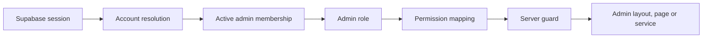

# Administrative architecture

## Purpose

Sprint 14A introduces a private, database-backed authorization layer for PetTap operations. It does not create a public admin product, customer CRUD or payment operations.

The database is authoritative. Supabase `user_metadata`, email addresses, browser state and hidden navigation are never authorization sources.

## Tables

- `admin_roles`: stable role codes.
- `admin_permissions`: stable `resource.action` capability codes.
- `admin_role_permissions`: normalized mapping with a composite primary key.
- `admin_memberships`: one membership per account, active or disabled.
- `audit_logs`: reused for sensitive admin events; this migration makes the actor nullable for first-admin bootstrap and adds a result field.

The admin tables receive RLS and no grants for `anon` or `authenticated`. Browser access through Supabase Data API is intentionally unavailable. Server-only repositories use the privileged database connection only after permission checks.
