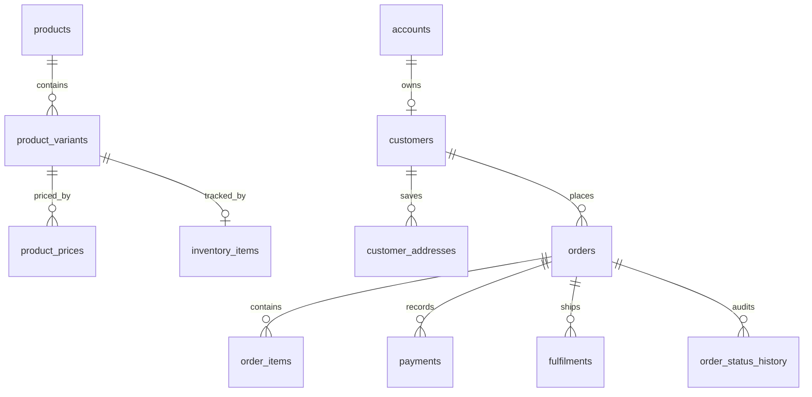

# Commerce architecture

## Summary

Sprint 13E adds a version-controlled commerce and operations foundation. It is intentionally backend-only: the public Coming Soon experience, private-route protection, checkout UI and payment providers are unchanged.

## Model

`future_orders` and `future_products` are preserved legacy placeholders. They are neither removed nor connected to this model; production data is never silently migrated.

## Pricing and snapshots

All amounts are integer minor units in `GBP` (for example, `2499` represents £24.99). The order and its line items persist names, SKU, price, currency and personalisation snapshots so later product edits cannot rewrite the commercial record.

The existing Studio checkout draft remains an isolated client-side presentation draft. It is not an authoritative commerce record and is deliberately not connected in this sprint.

## Boundaries

- Repositories are the only database access point for commerce features.
- Services own application flows and authorization hand-off.
- UI must not query Drizzle directly.
- Payments are a neutral data model only. No gateway, payment intent or webhook exists in this sprint.
- Inventory includes `quantity_reserved` for a future transactional reservation workflow; no reservation occurs today.

## Development seed

`npm run db:seed:commerce` is deliberately inert unless both `PETTAP_COMMERCE_SEED=1` and `PETTAP_COMMERCE_SEED_ENV=development` are supplied. It must never be used against production.
